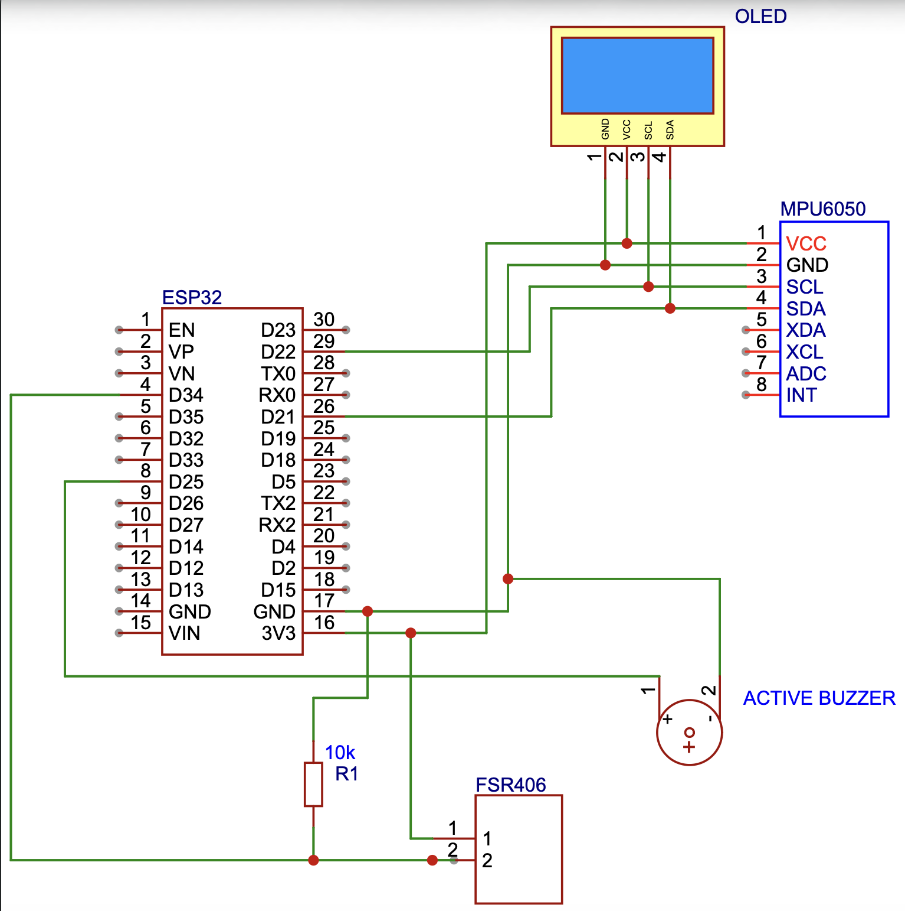
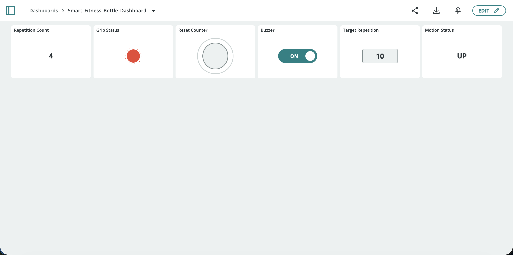

# IoT-Based Smart Fitness Bottle for Repetition Counting and Grip Monitoring

**Author:** Halit Dündar
**Course:** CSE 328 - Internet of Things, Akdeniz University

## 1. Project Summary
This project is an IoT-based smart fitness bottle designed to count biceps-curl repetitions while ensuring proper exercise form. The system utilizes an ESP32 microcontroller paired with an MPU6050 motion sensor to detect upward and downward movements, and an FSR406 force sensor to confirm the user is actively gripping the bottle. A 128x64 OLED screen provides real-time local feedback including the current repetition count, motion state, posture warnings (e.g., FORM: CHECK ARM!), mode, buzzer status, target value, grip status, Wi-Fi connection state along with signal strength (RSSI), and Cloud connection status. Sensor data is published continuously to a cloud dashboard over Wi-Fi, allowing the user to monitor session progress. Additionally, the system features 2-way control; users can set target repetitions, reset counters, and toggle an active buzzer for audio feedback directly from the cloud dashboard.

## 2. Components List
* **Microcontroller:** ESP32 Development Board.
* **Sensor 1:** MPU6050 6-axis accelerometer/gyroscope (detects bottle motion).
* **Sensor 2:** FSR406 Force Sensor (detects hand grip/pressure).
* **Display:** 128x64 OLED Display (I2C).
* **Actuator:** Active Buzzer (provides audio feedback).
* **Miscellaneous:** Breadboard, jumper wires, a PET bottle, and resistors for the FSR voltage divider.

## 3. Wiring Table and Diagram

*Note: The following GPIO pins are used for the physical connections.*

| Component    | ESP32 Pin          | Component Pin / Notes                       |
| :----------- | :----------------- | :------------------------------------------ |
| MPU6050      | 3V3                | VCC                                         |
| MPU6050      | GND                | GND                                         |
| MPU6050      | GPIO 21            | SDA                                         |
| MPU6050      | GPIO 22            | SCL                                         |
| OLED Display | 3V3                | VCC                                         |
| OLED Display | GND                | GND                                         |
| OLED Display | GPIO 21            | SDA (Shared I2C bus)                        |
| OLED Display | GPIO 22            | SCL (Shared I2C bus)                        |
| FSR406       | GPIO 34 (Analog)   | Connected with a 10kΩ pull-down resistor    |
| FSR406       | 3V3                | VCC                                         |
| Active Buzzer| GPIO 25            | Positive (+) terminal                       |
| Active Buzzer| GND                | Negative (-) terminal                       |

**Wiring Diagram:**

## 4. Cloud Setup
This project uses **Arduino Cloud** for remote monitoring and control. 

**Cloud Variables (Feeds):**
* `repetitionCount` (Integer, Read-Only): Sends the current repetition count to the cloud.
* `gripStatus` (Boolean, Read-Only): Indicates if the bottle is currently being held.
* `targetReps` (Integer, Read/Write): Allows the user to set a goal from the dashboard.
* `buzzerEnabled` (Boolean, Read/Write): Toggles the audio feedback on/off from the cloud.
* `motionState` (String, Read-Only): Sends the current motion state to the cloud.
* `resetCounter` (Boolean, Read/Write): Button to reset the repetition count.

**Dashboard Widgets:**
* **Value widgets** for `repetitionCount`, `targetReps` and `motionState`.
* **LED indicator** for `gripStatus`.
* **Switch** for `buzzerEnabled`.
* **Push Button** for `resetCounter`.

## 5. How to Run
1. **Hardware Setup:** Wire the components according to the Wiring Table.
2. **Software/Libraries:** Install the following libraries in Arduino IDE:
   * `Adafruit MPU6050`
   * `Adafruit GFX` & `Adafruit SSD1306` (for OLED)
   * `ArduinoIoTCloud` & `Arduino_ConnectionHandler`
3. **Board Settings:** Select "ESP32 Dev Module" from the Boards Manager.
4. **Network Configuration:** The `thingProperties.h` file contains Wi-Fi credentials and Arduino Cloud Device Secret. This file is automatically generated by the Arduino IoT Cloud editor. If you are compiling locally, you need to create this file manually. *(Note: This file is intentionally excluded from the repository for security reasons).*
5. **Upload:** Connect the ESP32 via USB and upload the code.

## 6. How it Works
1. **Data Acquisition:** The ESP32 continuously reads analog values from the FSR406 to check for a valid grip. Simultaneously, it reads X-axis, Y-axis, and Z-axis acceleration data from the MPU6050.
2. **Logic & Processing:** A repetition is only counted if the grip pressure exceeds a predefined threshold (Grip = ON) AND the motion sensor detects a complete "up and down" wave pattern on the X and Z axes.
3. **Posture/Form Check:** The system continuously monitors the Y-axis acceleration. If the user's arm moves outside the correct plane (e.g., flaring the elbow outwards, `a.acceleration.y > yFormLimit`), a "BAD FORM!" state is triggered. The OLED screen warns the user with "FORM: CHECK ARM!", and repetitions are paused until the posture is corrected.
4. **Local Output:** The OLED screen instantly updates to display the Wi-Fi network status and signal strength (RSSI), Cloud connection status, mode, grip status, buzzer status, motion state (including form warnings like 'FORM: CHECK ARM!'), and current vs. target reps.
5. **Cloud Synchronization:** The `ArduinoCloud.update()` function syncs local variables with the cloud dashboard.
6. **Dashboard Control:** If the user updates the `targetReps` or toggles the buzzer switch on the dashboard, the ESP32 receives these commands in real-time. When `repetitionCount` >= `targetReps` && `buzzerEnabled`, the ESP32 triggers the active buzzer.

## 7. Evidence
**Dashboard Screenshots:**

**Project Demo:**
* [Click here to watch the demonstration video](YouTube_or_Drive_Link)
